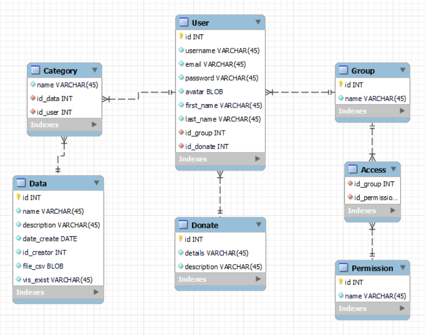

# Проєктування бази даних

## Модель бізнес-об'єктів

@startuml
entity Category
entity Category.id_data  #ffffff
entity Category.id_user #ffffff 
 

entity Data
entity Data.id  #ffffff 
entity Data.name  #ffffff 
entity Data.description  #ffffff 
entity Data.category_id  #ffffff
entity Data.date_create #ffffff
entity Data.id_creator #ffffff
entity Data.file_csv #ffffff
entity Data.id_category #ffffff

entity User
entity User.id  #ffffff 
entity User.username  #ffffff
entity User.email  #ffffff 
entity User.password  #ffffff 
entity User.avatar #ffffff
entity User.first_name  #ffffff 
entity User.last_name  #ffffff 
entity User.id_group #ffffff 
entity User.id_donate #ffffff 

entity Group
entity Group.id  #ffffff 
entity Group.name  #ffffff 

entity Access
entity Access.id_group #ffffff 
entity Access.id_permission #ffffff 

entity Permission
entity Permission.id  #ffffff 
entity Permission.name  #ffffff 

entity Donate
entity Donate.id #ffffff 
entity Donate.details #ffffff 
entity Donate.description #ffffff 

User "1,1" --d- "0,*" Category
Category "0,*" -d-- "1,1" Data
User "0,*" --d- "1,1" Group
Access "0,*" -r-- "1,1" Group
Access "0,*" -d-- "1,1" Permission
User "0,*" --r- "1,1" Donate

User.id  -d-* User
User.username  -d-* User
User.email -d-* User
User.password  -d-* User
User.avatar -d-* User
User.first_name -d-* User 
User.last_name -d-* User 
User.id_group -d-* User 
User.id_donate -d-* User

Data.id -u-* Data 
Data.name -u-* Data  
Data.description -u-* Data 
Data.date_create -u-* Data
Data.id_creator -u-* Data
Data.file_csv -u-* Data
Data.vis_exist -u-* Data

Category.name -r-* Category 
Category.id_data -l-* Category 
Category.id_user -u-* Category

Group.id -u-* Group
Group.name -u-* Group

Access.id_group -u-* Access
Access.id_permission -r-* Access
   
Permission.id  -u-* Permission
Permission.name -u-* Permission

Donate.id -u-* Donate
Donate.details -u-* Donate
Donate.description  -u-* Donate
@enduml

## Опис моделей

### User

Сутність, яка являє собою обліковий запис користувача з особистою інформацією.
Має поля:
- id - id користувача
- username - псевдонім користувача.
- email - адреса електронної пошти користувача.
- password - пароль користувача.
- avatar - фотографія профілю користувача.
- first_name - справжнє ім'я користувача'
- last_name - прізвище користувача.
- id_group - id групи в якый користувач перебуває.
- id_donate - унікальний код користувача для матеріальної допомоги.

### Group

Сутність, яка використовується для визначення прав користувача.
Має поля:
- id - id правовоъ групи.
- name - назви груп.

Група може не мати прав, або може мати скільки завгодно.
Група може не мати доступів, або може мати скільки завгодно.

### Access

Сутність, яка зберігає в собі сукупність ролей, що надаються групі. Своєрідний буфер для надання групі тих чи інших прав.
Має поля:
- id-group - id групи якій будуть надані ті чи інші права.
- id-permission - id права(можливості) яку може використовувати та чи інша група.

### Permission

Сутність що зберігає в собі права які можуть бути надані користувачу
Має поля:
- id - права що може бути надане групі.
- name - назва права.

### Category

Сутність, яка являє собою категорію до якої належить файл даних.
Має поля:
- name - назва категорії.
- id_data - id даних що відноситься до даної катеогрії.
- id_user - id користувача що виконує пошук даних з цієї категорії.

### Data

Сутність, яка являє собою файл з набором певних статистичних даних.
Має поля:
- id - id даних.
- name - назва даних.
- description - опис змісту даних.
- date_create - дата публікації даних
- id_creator - id творця даних
- file_csv - формат відображення даних.
- vis_exist - посилання на вызуалызаыю

## ER-модель

@startuml
entity Category {
name: TEXT 
id_data: INT 
id_user: INT 
}

entity Data { 
id: UUID 
name: TEXT 
description: TEXT 
date_creation: DATE 
id_create: INT 
file_csv: BLOB 
vis_exist: TEXT 
}

entity User { 
id: UUID
username: TEXT
email: TEXT 
password: TEXT
avatar: BLOB 
first_name: TEXT 
last_login: DATE 
is_group: INT 
id_donate: INT 
}

entity Group { 
id: UUID 
name: TEXT  
}

entity Access{
id_group: UUID
id_permission: UUID
}

entity Permission { 
id: UUID
name: TEXT 
}

entity Donate{
id: UUID
details: TEXT
description: TEXT
}
User "1,1" --l- "0,*" Category
Category "0,*" --d- "1,1" Data
User "0,*" --r- "1,1" Group
Access "0,*" -u-- "1,1" Group
Access "0,*" -d-- "1,1" Permission
User "0,*" --d- "1,1" Donate
@enduml

## Реляційна схема

