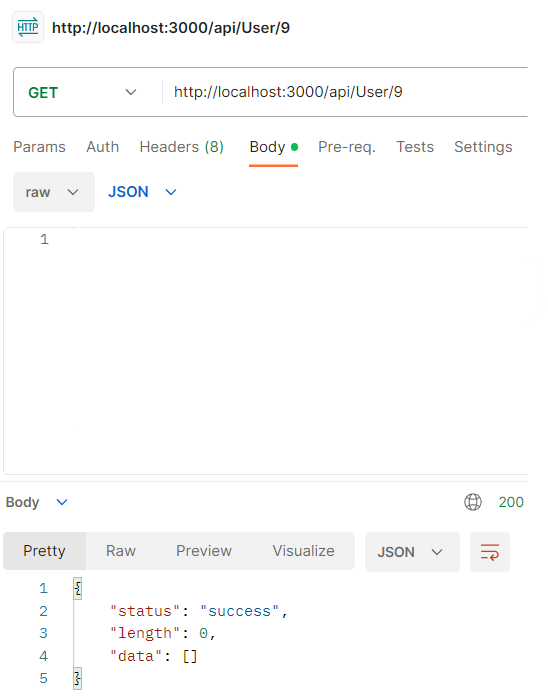
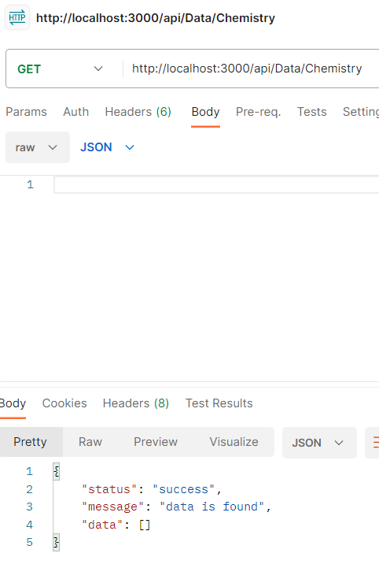

# Тестування працездатності системи

*В цьому розділі необхідно вказати засоби тестування, навести вихідні коди тестів та результати тестування.*
## Показати всіх наявних користувачів

## Створити нвого користувача

## Оновити інформацію про користувача

## Видалити користувача

## Показати всю наявну в базі інформацію

## Створити новий файл з інформацією

## Оновити(редагувати) вже наявну інформацію

## Видалити інформацію з бази

## Показати всі групи користувачів

## Показати всі наявні в системі можливості

